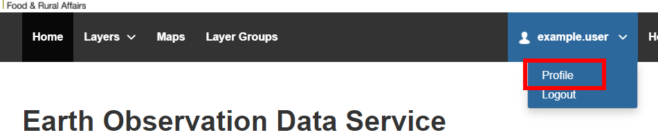
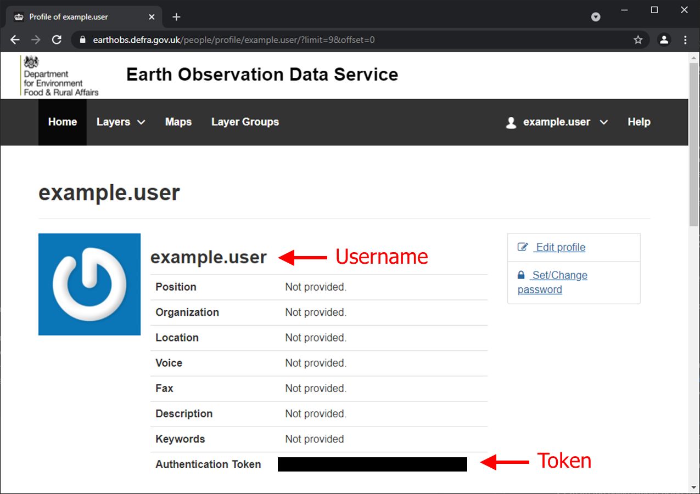

# EODS-API
This repo provides a wrapper library and collection of example Jupyter notebooks for pan-Defra users of the Earth Observation Data Service. You can find example videos on how to use these scripts at https://earthobs.defra.gov.uk/help/


# Building your local environment

This repo provides alternative ways to build your environment.

The options are:
* Method #1. [Ananconda](https://anaconda.org/). Specifically, we recommend using the `miniconda` (slimmed down) package manager of the Anaconda Distribution System. If you use a Windows OS, this is what we recommend. Tested with `python==3.8.8` and the pinned package versions in ./environment.yml.
* [Docker](https://www.docker.com/). We include a `Dockerfile` in the root of the repo for builing a docker Image locally. We recommend this approach if you're using MacOS or Linux. Tested with `python==3.8.8` and the pinned container tags version in ./Dockerfile, which uses the pinned package versions in ./requirements.txt.
* Alternatively, for macOS/Linux users, you can build your environment with `pip` and python's `virtualenv` module. Tested with `python==3.8.9` with the pinned package versions in ./requirements.txt.

# Handling your EODS credentials

* You will need to authenticate using your EODS username and api token, note your token is different to your password.
* Credentials are entered into an Environment file (`.env`), located in the root of the repo. A sample file is provided:
```bash
$ cat sample.env
HOST=https://earthobs.defra.gov.uk/
API_USER=someuser
API_TOKEN=sometoken
```
* Either override the defaults with your own credentials, or create a new `.env` file with your own credentials.
* Within the example notebooks, there is an opportunity to reference your own environment file, here is an python example to reference a specific environment file:
```python
from dotenv import load_dotenv
load_dotenv('user-specific.env')

# alternatively:
from dotenv import load_dotenv
load_dotenv() # if you name you environment file ".env" and it sits in the root, then you do not need to specific a named file.

```
* If you are unsure of your credentials, you can retrive your username and token from the EODS portal https://earthobs.defra.gov.uk/.
* Login, on the navigation bar, click your username on the right, and select "Profile" from the droplist

* Your username and Token are available on the Profile page:

* Once you have your credentials, you can paste into the .env

# Build with Miniconda

* Recommended for Windows uses, as miniconda nicely pulls in the C libraries for GDAL, which can be problematic when using python virtual envs (see other Build option).

0. Prerequisite. Ensure you've configured your credentials in the .env referenced above.
1.	If you do not already have it, download and install Miniconda on your system: https://docs.conda.io/en/latest/miniconda.html 
2.	Once installed, open the Anaconda Powershell Prompt – this should now be available on your start menu.  Navigate to this repo using the Anaconda Powershell Prompt using the following command:  
cd <filepath>
3.	Create the environment using the following command:
```bash
conda env create --file environment.yml
```
4.	Activate the environment using the following command
```bash 
conda activate eods
```
5.	Launch the Jupyter Notebook in your browser with the following command:
```bash
jupyter notebook
```
6.	The Jupyter Notebook server should now be open in your web browser, enabling you to view and navigate the contents of this repo.  Double click on any/the relevant Jupyter Notebook.

If for any reason you need to update your conda environment using the `environment.yml` file, use this command:
```bash
conda env update --file environment.yml
```

# Build with python virtual environment (`venv`) and `pip`

For macOS, linux or Windows Subsystem for Linux, you have the option of using the native virtual environment feature within python3, see [docs](https://docs.python.org/3/tutorial/venv.html).

This assumes you have a working copy of python3 (python version >3.3) pre-installed.

Navigate your shell to the root of the repo:

```bash
Within the root of the repo

# STEP1. Ensure you have the python3-venv package
$ apt-get install python3-venv

# STEP2. Create a python virtual environment
$ python3 -m venv .venv

# STEP3. Source into your virtual environment
$ source .venv/bin/activate

# STEP4. Install the requirements
$ pip install -r requirements.txt

# STEP5. Check your python installation
$ which python

# STEP6. Launch the jupyter notebook server
$ jupyter notebook

# NOTE. If you have multiple pythons installed on your system, `python -m venv <env>` can sometimes be problematic

# alternatively, you can use `virtualenv` package, assuming you want to use something other than system python, e.g.:
$ /usr/bin/python3.8 --version

# STEP1. install `virtualenv` package
$ sudo apt-get install python-virtualenv

# STEP2. create the virtual environment
$ virtualenv --python=/usr/bin/python3.8 .venv

# NOTE on STEP3. pick up above with sourcing the virtual env.

# NOTE on STEP4. You might have to edit `requirements.txt` and drop specific versions to accomodate your python version.


```
This build was tested with python 3.8.9

# Build with Docker

A `Dockerfile` is also available for building a docker image locally on your system.  This assumes you've got either docker destop or docker engine installed on your system.

```bash
# ensure you're in the repo root directory

# STEP1. Build the docker image locally and install dependancies
$ docker build . --tag eodslib

# STEP2. Run the container to launch the jupyter notebook
$ docker run --rm -p 8888:8888 -v <local-repo-directory>:/opt/app/ eodslib

# In the console output, copy the URL to the local notebook server and paste to your web browser
```
